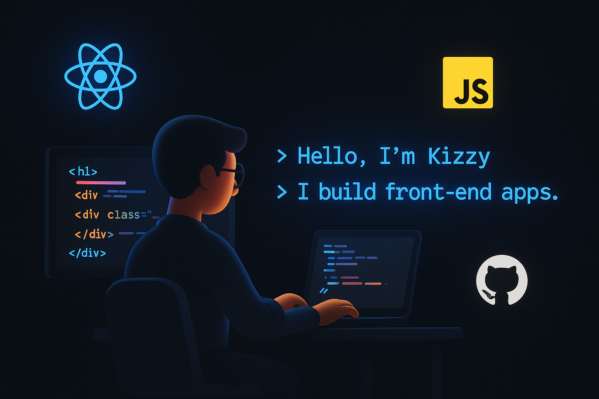

# Hello! 👋 I'm Kizzy 
🌟 A passionate **Front-End Developer** dedicated to crafting visually appealing and user-friendly web interfaces.
I specialize in creating user-friendly and responsive web applications using modern technologies like HTML, CSS, JavaScript, and React.

## 🛠️ Skills
- **Languages**:    
- **Frameworks**:   
- **Tools**: 

  ## 🏆 GitHub Contributions and Streak

📫 **Reach me at:**  
- Email: [bellokazeem908@gmail.com](mailto:bellokazeem908@gmail.com)  
- LinkedIn: [KizzyHub](https://www.linkedin.com/in/kazeem-bello-8243b5355/)

⚡ **Fun fact:**  
I love spaghetti, Manchester United, and exploring new JAVASCRIPTS libraries.

### 🏆 GitHub Trophies

## 🚀 Projects
- **[Simple Landing Page](https://github.com/kizzyhub/Simple-Landing-Page)**: A simple landing page built with ReactJS.  
  [Live Demo](https://kizzyhub.github.io/Simple-Landing-Page/)

- **[Figma-Project](https://github.com/kizzyhub/Figma-Project)**: Translates Figma designs into fully functional HTML code.  
  [Live Demo](https://kizzyhub.github.io/Figma-Project/)

- **[Barber-Web](https://github.com/kizzyhub/Barber-Web)**: A simple and responsive website for a barber shop.  
  [Live Demo](https://kizzyhub.github.io/Barber-Web/)
  
## 🤝 Let's Connect!
I'm always open to collaborating on interesting projects. Feel free to reach out!

🌟 _Feel free to explore my repositories or connect with me!_

  

